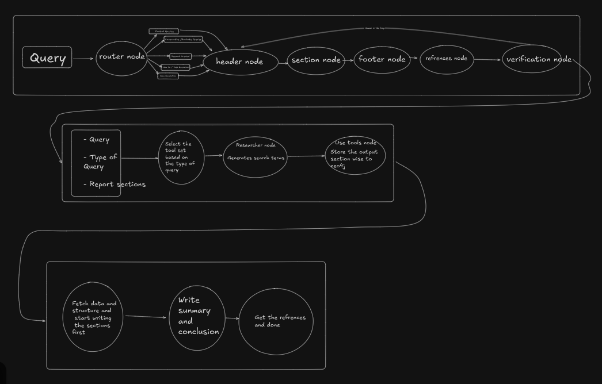

# Open Deep Research

**Open Deep Research** is an automated research pipeline that takes a natural language query and produces a well-structured, tool-augmented research report. It leverages graph-based agentic flows to structure, research, and synthesize content into a coherent final report using multiple LLMs and APIs.

## 🧠 Overview

The system is composed of **three primary graphs**, each responsible for a distinct phase:

1. **Section Graph** – Defines and builds the report skeleton: header, sections, footer, and validation.
2. **Research Graph** – Generates search terms based on the query and uses tools to fetch relevant information.
3. **Writer Graph** – Synthesizes fetched information into detailed content and formats the report.

The core engine relies on stateful node transitions built using `StateGraph`, enabling modularity and reusability across agents.

## 🗺️ Architecture Flow



### Section Graph
* Designs the report structure
* Takes user feedback

### Research Graph
* Determines tools based on query type
* Generates search terms
* Executes tools and stores outputs section-wise

### Writer Graph
* Writes sections and structure
* Summarizes and writes the conclusion
* Adds references and formats the final report

## 🧪 Requirements

Ensure the following environment variables are set in a `.env` file at the root:
```env
EXA_API_KEY=0f...
SERPER_API_KEY=7c...
GITHUB_ACCESS_TOKEN=github_pat_...
TOGETHER_API_KEY=tgp_...
LANGFUSE_SECRET_KEY=sk-lf-...
LANGFUSE_PUBLIC_KEY=pk-lf-...
LANGFUSE_HOST=https://cloud.langfuse.com
TAVLIY_API_KEY=tvly-...
GROQ_API_KEY=gsk_...
```

**Python version:** 3.10  
**Package manager:** [uv](https://github.com/astral-sh/uv)

Install dependencies:
```bash
uv venv
source .venv/bin/activate
uv sync
```

## 🏗️ Project Structure

```
.
├── pyproject.toml
├── README.md
├── src
│   ├── components
│   │   ├── chains.py
│   │   ├── prompts.py
│   │   └── tools.py
│   ├── config.py
│   ├── edges.py
│   ├── graph.py
│   ├── nodes.py
│   ├── observability
│   │   └── langfuse_setup.py
│   └── utilities
│       ├── helpers
│       │   ├── LLMProvider.py
│       │   ├── logger.py
│       │   └── parsers.py
│       └── states
│           ├── report_state.py
│           ├── research_state.py
│           ├── shared_state.py
│           └── tool_state.py
└── uv.lock
```

## ⚙️ Graph Composition

### Section Graph
```python
section_builder.add_edge(START, "router_node")
section_builder.add_edge("router_node", "header_writer_node")
section_builder.add_edge("header_writer_node", "section_writer_node")
section_builder.add_edge("section_writer_node", "footer_writer_node")
section_builder.add_edge("footer_writer_node", "verify_report_node")
section_builder.add_conditional_edges("verify_report_node", verify_conditional_edge)
```

### Research Graph
```python
research_builder.add_edge(START, "query_generation_node")
research_builder.add_edge("query_generation_node", "tool_output_node")
```

### Writer Graph
```python
writer_builder.add_edge(START, "detailed_section_writer_node")
writer_builder.add_edge("detailed_section_writer_node", "detailed_header_writer_node")
writer_builder.add_edge("detailed_header_writer_node", "detailed_footer_writer_node")
writer_builder.add_edge("detailed_footer_writer_node", "report_formatter_node")
```

## ✅ Flow Summary

1. **Initialize Report**: Section Graph builds the skeleton.
2. **Research Phase**: Research Graph chooses tools, generates queries, and fetches data.
3. **Write Phase**: Writer Graph compiles structured, sectioned, and formatted output.
4. **Verification**: The final report is validated and references are added.

## 🤝 Contributing

Open Deep Research is an open-source project and welcomes contributions from the community. Whether it's adding new features, improving documentation, or fixing bugs, your help is appreciated.

To contribute:
1. Fork the repository
2. Create a new branch for your feature
3. Submit a pull request